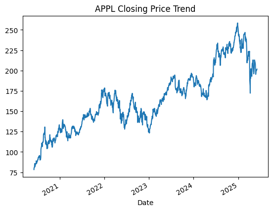
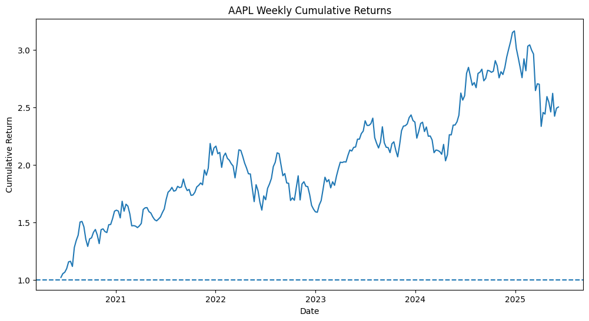

# **APPL (Apple Inc) Stock Analysis Report**

## **Introduction**

This report analyzes the characteristics of Apple Inc. (AAPL) by analyzing the historical stock price behavior from 2020 to 2025. The reportiu focuses on trend analysis, cumulative returns, closing price trend and volatility analysis to evaluvate both risk and performance.

## **About the Dataset**

The dataset `2020-2025 Apple Stock Dataset` by `Saman Fatima` is downloaded from Kaggle, contains daily historical stock price data for Apple Inc (APPL), it includes variables like opening and closing prices, highest and lowest prices, highest and lowest prices of the day and trading volume. 

For some analysis, daily data was converted to weekly frequency to reduce the noise. 

## **Methodology**

This analysis was performed using Python and used libraries like Pandas for the data analysis and matplotlib for data visualization. The dataset was a CSV file which contains daily historical stock price data for Apple Inc. (AAPL).

The column `Date` was converted to datetime format to enable time series operations. `Closing prices` were converted to numeric values for accurate calculations. Daily data was resampled to a weekly frequency by selecting the last trading day of each week.

Weekly returns were calculated by taking the percentage change in weekly closing price. Cumulative returns were calculated to represent the growth of the investment. Daily closing price were illustrated to provide an understanding of price movements. 

`Standard deviation` of daily returns is used to calculate `volatility`

## **Closing Price Trend**

The closing price was plotted to observe the overall closing price movement and trends

__Observations:__
* The stock (APPL) shows an upward trend over the period, which indicates a positive performance. Over the years there were some short term fluctuations especially during the period of mid 2022 to 2023 and during 2025. 

___fig:1.0 Closing Price Trend___

## **Trend Analysis: 10 Week Moving Average (MA)**

.png)

___fig:2.0 Trend analysis of 10 Week moving average___

## **Cumulative Returns**

___fig:3.0 Cumulative Returns___

## **Conclusion**

